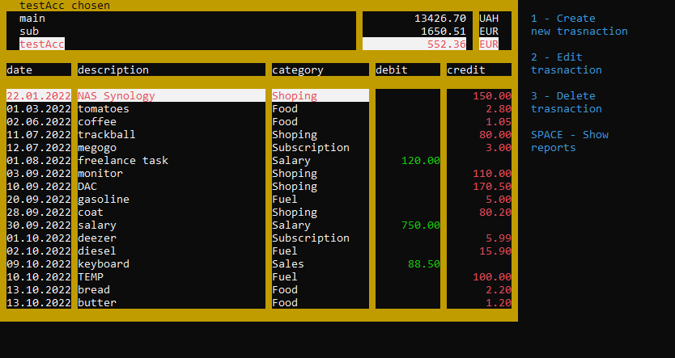

# Finance Manager  

Finance Manager is a application that helps you to manage your finances.
With this app you can monitor your account transactions (money flow). Menu Reports can show many financial reports for chosen account such as:  
report for last 'N' days, monthly report, category report and biggest 'N' transactions.  

You can add as many accounts as you want. 

Screen of Main Menu:  

Screen of Settings Menu:  

Screen of My Accounts Menu:  

Screen of Monthly Report:  

Screen of Category Report:  
